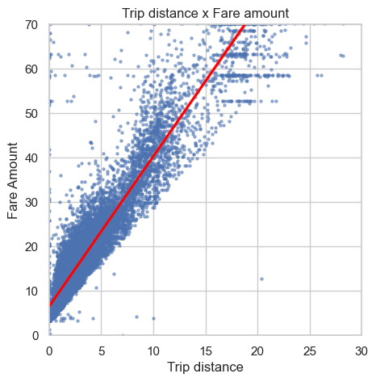

# Predictive Modelling of Taxi Fares in NYC Overview
The project uses a multiple linear regression model to

### Problem
How do we effectively predict taxi cab fares prior to the ride? what are the responsible variables that successfully predict taxi cab fares?

### Objective
Estimate taxi cab fares prior to the ride.

### Data Understanding
The data comes from the NYC Taxi and Limousine Commission <a href="https://data.cityofnewyork.us/Transportation/2017-Yellow-Taxi-Trip-Data/biws-g3hs">open data</a>. The data that we use consists of 22.7k data points and 18 variables. The variables included information on trip duration and distance, the vendor used, fare amount, and passenger count. We added 2 columns to generalize the trip duration and distance. The mean duration and mean distance are depicted by all trips that share a unique pair of start and end points which are grouped and averaged. The pickup and dropoff time are for the mean duration and the pickup and dropoff location are for the mean distance. The scatterplot shows that the fare amount is positively correlated to the mean duration and mean distance.

In line with the data, we also employ a data-cleaning process to clean the data. We impute the outliers after checking it out on a boxplot and we assign a threshold amount to impute the data. We also dropped off irrelevant and redundant variables and isolated only the vendorID, passenger count, fare amount, mean distance, mean duration, and rush hour.

### Data Analysis and Evaluation
The multiple linear regression model shows a scatterplot for the actual and predicted value which showcases the predicted fare amount of taxi cab rides with reasonable confidence. The 2 linear data points at the left part of the plot are the imputed maximum of $62.50 and the flat rate of $52 for JFK airport trips. The overall model has a coefficient of determination of 86.8%. By getting the model coefficients, we show that the mean distance has the greatest weight in predicting the outcome of the model which has a mean of $7.13 change for every +1 change in the standard deviation. This means that there is approximately a $2 increase for every 1 mile added on the trip.

Binning the residuals shows that the residuals from our model follow a normal distribution around zero with a mean of -0.015. This is good because it means our model's errors are spread out and evenly distributed. This demonstrates that our model is pretty close to its predictions.

### Conclusion
Testing

### Key takeaways
- test1
- test2
- test3
